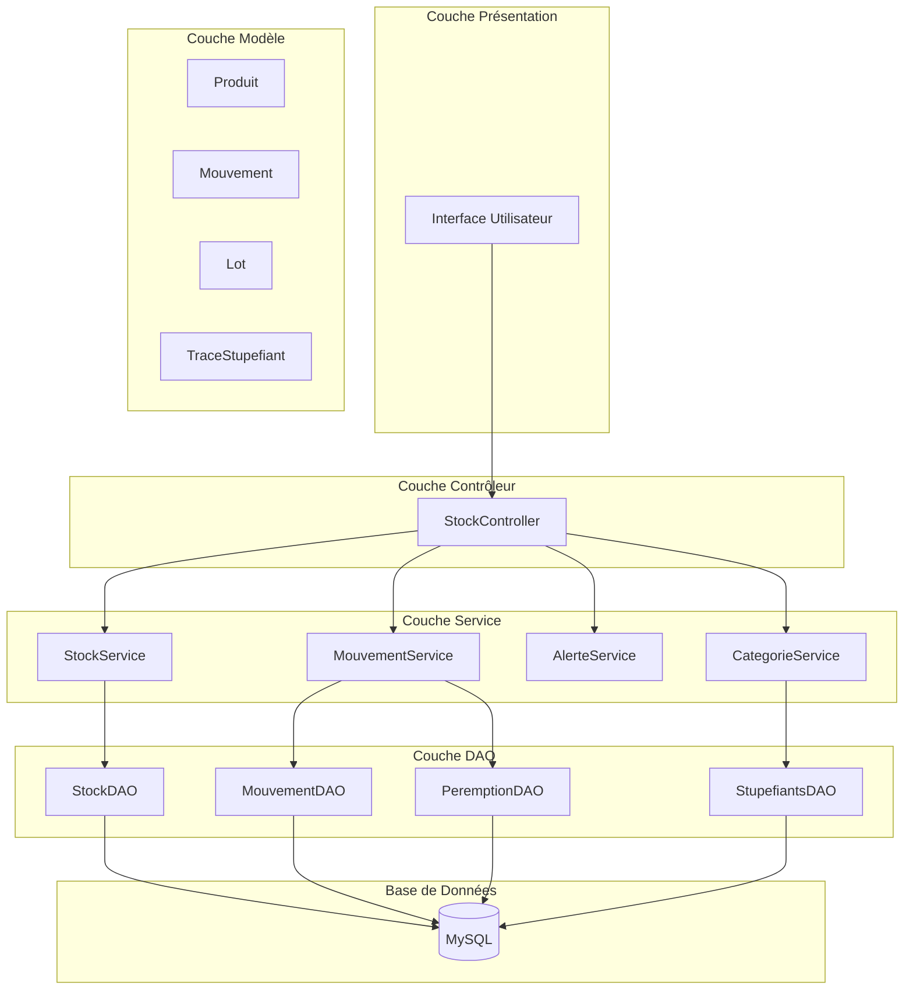
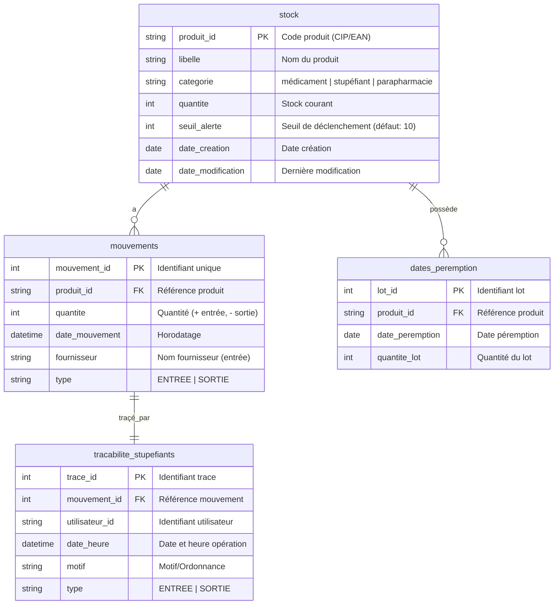

# Design Technique - Extension Gestion de Stock Pharmacie

## 1. High-Level Design

### 1.1 Architecture Générale



### 1.2 Modèle de Données



### 1.3 Flux Système

#### Flux 1: Réception de Marchandises
```
┌─────────────┐     ┌─────────────┐     ┌─────────────┐     ┌─────────────┐
│   Gestion-   │────▶│ Validation  │────▶│   Création  │────▶│  Mise à jour │
│   naire      │     │   Entrée    │     │   Produit   │     │    Stock     │
└─────────────┘     └─────────────┘     └─────────────┘     └─────────────┘
                                                                     │
                                                                     ▼
┌─────────────┐     ┌─────────────┐     ┌─────────────┐     ┌─────────────┐
│   Commit    │◀────│   Rollback  │◀────│   Erreur    │◀────│  Mouvement  │
│   OK        │     │   Erreur    │     │   SQL       │     │   Créé      │
└─────────────┘     └─────────────┘     └─────────────┘     └─────────────┘
                                                                     │
                                                                     ▼
                                                             ┌─────────────┐
                                                             │   Lot Per.   │
                                                             │   Créé      │
                                                             └─────────────┘
```

#### Flux 2: Sortie de Produits
```
┌─────────────┐     ┌─────────────┐     ┌─────────────┐     ┌─────────────┐
│  Pharmacien │────▶│ Validation  │────▶│ Stock       │────▶│ Vérification│
│             │     │   Quantité  │     │ Suffisant?  │     │   Alerte    │
└─────────────┘     └─────────────┘     └─────────────┘     └─────────────┘
                                           │                       │
                          ┌────────────────┘               ┌────────┴────────┐
                          ▼                                  ▼                 ▼
                   ┌─────────────┐                    ┌─────────────┐   ┌─────────────┐
                   │   Sortie    │                    │  Alerte     │   │   Message   │
                   │   Stock     │                    │   Déclenchée│   │  Erreur     │
                   └─────────────┘                    └─────────────┘   └─────────────┘
                          │
                          ▼
                   ┌─────────────┐
                   │  Mouvement  │
                   │   Créé      │
                   └─────────────┘
```

---

## 2. Low-Level Design

### 2.1 Structure des Packages

```
fr.pharmacie.stock
├── model/
│   ├── Produit.java
│   ├── Mouvement.java
│   ├── Lot.java
│   └── TraceStupefiant.java
├── dao/
│   ├── StockDAO.java
│   ├── MouvementDAO.java
│   ├── PeremptionDAO.java
│   └── StupefiantsDAO.java
├── service/
│   ├── StockService.java
│   ├── MouvementService.java
│   ├── AlerteService.java
│   └── CategorieService.java
└── controller/
    └── StockController.java
```

### 2.2 Classes Java - Signatures

#### Model - Produit.java
```java
package fr.pharmacie.stock.model;

/**
 * Représente un produit pharmaceutique en stock.
 */
public class Produit {
    private String produitId;      // Code CIP (7 chiffres) ou EAN (13 chiffres)
    private String libelle;        // Nom du produit
    private String categorie;      // "médicament", "stupéfiant", "parapharmacie"
    private int quantite;          // Stock courant
    private int seuilAlerte;       // Seuil de déclenchement (défaut: 10)
    
    // Constructeurs, getters, setters
}
```

#### Model - Mouvement.java
```java
package fr.pharmacie.stock.model;

/**
 * Représente un mouvement de stock (entrée ou sortie).
 */
public class Mouvement {
    private int mouvementId;
    private String produitId;
    private int quantite;          // Positive pour entrée, négative pour sortie
    private LocalDateTime dateMouvement;
    private String fournisseur;    // Null pour les sorties
    private String type;           // "ENTREE" ou "SORTIE"
    
    // Constructeurs, getters, setters
}
```

#### DAO - StockDAO.java
```java
package fr.pharmacie.stock.dao;

import fr.pharmacie.stock.model.Produit;
import java.sql.*;
import java.util.*;

/**
 * Data Access Object pour les opérations sur le stock.
 */
public class StockDAO {
    private Connection connection;
    
    public StockDAO(Connection connection) {
        this.connection = connection;
    }
    
    /**
     * Crée ou récupère un produit.
     * @param produitId Code produit
     * @param libelle Nom du produit
     * @param categorie Catégorie du produit
     * @return Le produit créé ou existant
     */
    public Produit trouverOuCreer(String produitId, String libelle, String categorie) 
            throws SQLException;
    
    /**
     * Met à jour la quantité en stock.
     * @param produitId Code produit
     * @param deltaQuantite Variation (+/-)
     */
    public void modifierQuantite(String produitId, int deltaQuantite) 
            throws SQLException;
    
    /**
     * Récupère un produit par son identifiant.
     */
    public Optional<Produit> trouverParId(String produitId) throws SQLException;
    
    /**
     * Met à jour le seuil d'alerte.
     */
    public void modifierSeuilAlerte(String produitId, int seuil) throws SQLException;
    
    /**
     * Liste tous les produits avec stock inférieur au seuil.
     */
    public List<Produit> listerAlertes() throws SQLException;
}
```

#### Service - MouvementService.java
```java
package fr.pharmacie.stock.service;

import fr.pharmacie.stock.model.Mouvement;
import java.sql.*;
import java.time.LocalDateTime;
import java.util.*;

/**
 * Service pour la gestion des mouvements de stock.
 */
public class MouvementService {
    private Connection connection;
    
    public MouvementService(Connection connection) {
        this.connection = connection;
    }
    
    /**
     * Enregistre une réception de marchandises.
     * @param produitId Code produit
     * @param quantite Quantité reçue (1-999999)
     * @param datePeremption Date de péremption (format AAAA-MM-JJ, future)
     * @param fournisseur Nom du fournisseur (1-200 caractères)
     * @param libelle Nom du produit
     * @param categorie Catégorie du produit
     * @param utilisateurId Identifiant utilisateur (pour stupéfiants)
     * @param motif Motif (pour stupéfiants)
     * @return ResultatMouvement résultat de l'opération
     */
    public ResultatMouvement enregistrerEntree(
            String produitId, int quantite, String datePeremption,
            String fournisseur, String libelle, String categorie,
            String utilisateurId, String motif) throws SQLException;
    
    /**
     * Enregistre une sortie de produits.
     * @param produitId Code produit
     * @param quantite Quantité demandée (1-999999)
     * @param utilisateurId Identifiant utilisateur (pour stupéfiants)
     * @param motif Motif (pour stupéfiants)
     * @return ResultatMouvement résultat de l'opération
     */
    public ResultatMouvement enregistrerSortie(
            String produitId, int quantite,
            String utilisateurId, String motif) throws SQLException;
    
    /**
     * Récupère l'historique des mouvements d'un produit.
     */
    public List<Mouvement> getHistorique(String produitId) throws SQLException;
}
```

### 2.3 Algorithmes

#### Algorithme: Enregistrer une Entrée
```
ALGORITHME enregistrerEntree(produitId, quantite, datePeremption, 
                            fournisseur, libelle, categorie, 
                            utilisateurId, motif)

    // 1. Validation des paramètres
    SI quantite <= 0 OU quantite > 999999 ALORS
        RETOURNER ERREUR: "Quantité invalide (1-999999)"
    FIN SI
    
    SI datePeremption EST NULL OU datePeremption <= CURDATE() ALORS
        RETOURNER ERREUR: "Date de péremption invalide"
    FIN SI
    
    SI fournisseur EST NULL OU longueur(fournisseur) > 200 ALORS
        RETOURNER ERREUR: "Fournisseur invalide"
    FIN SI
    
    // 2. Vérification stupéfiant
    SI categorie == "stupéfiant" ALORS
        SI utilisateurId EST NULL OU longueur(utilisateurId) > 50 ALORS
            RETOURNER ERREUR: "Utilisateur requis pour stupéfiant"
        FIN SI
        SI motif EST NULL OU longueur(motif) > 500 ALORS
            RETOURNER ERREUR: "Motif requis pour stupéfiant"
        FIN SI
    FIN SI
    
    TENTER
        DEBUT TRANSACTION
        
        // 3. Création/récupération produit
        produit = StockDAO.trouverOuCreer(produitId, libelle, categorie)
        
        // 4. Mise à jour stock
        StockDAO.modifierQuantite(produitId, quantite)
        
        // 5. Création mouvement
        mouvementId = MouvementDAO.creer(produitId, quantite, NOW(), 
                                         fournisseur, "ENTREE")
        
        // 6. Création lot péremption
        PeremptionDAO.creer(produitId, datePeremption, quantite)
        
        // 7. Traçabilité stupéfiant
        SI categorie == "stupéfiant" ALORS
            StupefiantsDAO.creer(mouvementId, utilisateurId, NOW(), 
                                motif, "ENTREE")
        FIN SI
        
        VALIDER TRANSACTION
        RETOURNER SUCCES: "Entrée enregistrée"
        
    EXCEPTION SQL
        ANNULER TRANSACTION
        RETOURNER ERREUR: "Erreur base de données"
    FIN TENTER
FIN ALGORITHME
```

### 2.4 Requêtes SQL Documentées

#### Table stock
```sql
-- Créer ou récupérer un produit
INSERT INTO stock (produit_id, libelle, categorie, quantite, seuil_alerte)
VALUES (?, ?, ?, 0, 10)
ON DUPLICATE KEY UPDATE libelle = VALUES(libelle), categorie = VALUES(categorie);

-- Modifier la quantité
UPDATE stock SET quantite = quantite + ? WHERE produit_id = ?;

-- Trouver un produit
SELECT * FROM stock WHERE produit_id = ?;

-- Lister les alertes (stock < seuil, défaut 10)
SELECT * FROM stock 
WHERE quantite < COALESCE(seuil_alerte, 10)
ORDER BY quantite ASC;
```

#### Table mouvements
```sql
-- Créer un mouvement
INSERT INTO mouvements (produit_id, quantite, date_mouvement, fournisseur, type)
VALUES (?, ?, NOW(), ?, ?);

-- Récupérer historique (100 derniers, tri décroissant)
SELECT * FROM mouvements 
WHERE produit_id = ?
ORDER BY date_mouvement DESC, mouvement_id DESC
LIMIT 100;
```

#### Table dates_peremption
```sql
-- Créer un lot
INSERT INTO dates_peremption (produit_id, date_peremption, quantite_lot)
VALUES (?, ?, ?);

-- Trouver la date de péremption la plus proche (non expirée)
SELECT MIN(date_peremption) 
FROM dates_peremption 
WHERE produit_id = ? AND date_peremption > CURDATE();
```

#### Table tracabilite_stupefiants
```sql
-- Créer trace stupéfiant
INSERT INTO tracabilite_stupefiants 
(mouvement_id, utilisateur_id, date_heure, motif, type)
VALUES (?, ?, NOW(), ?, ?);

-- Récupérer historique avec traçabilité
SELECT m.*, t.utilisateur_id, t.motif
FROM mouvements m
LEFT JOIN tracabilite_stupefiants t ON m.mouvement_id = t.mouvement_id
WHERE m.produit_id = ?
ORDER BY m.date_mouvement DESC;
```

### 2.5 Gestion des Transactions

```java
// Pattern de gestion des transactions JDBC
public ResultatMouvement enregistrerEntree(...) throws SQLException {
    boolean originalAutoCommit = connection.getAutoCommit();
    try {
        connection.setAutoCommit(false);
        
        // Opérations DAO...
        
        connection.commit();
        return ResultatMouvement.succes();
        
    } catch (SQLException e) {
        connection.rollback();
        throw e;
    } finally {
        connection.setAutoCommit(originalAutoCommit);
    }
}
```

---

## 3. Propriétés de Correction

### 3.1 Exigence 1: Réception de Marchandises

| Propriété | Type | Description |
|-----------|------|-------------|
| Invariant | Stock | `stock_final = stock_initial + quantite` |
| Métamorphique | Mouvement | `count(mouvements) augmente de 1` |
| Round-trip | Lot | `insert(lot) → select(lot).equals(lot)` |

### 3.2 Exigence 2: Sortie de Produits

| Propriété | Type | Description |
|-----------|------|-------------|
| Invariant | Stock | `stock_final = stock_initial - quantite` (si stock >= quantite) |
| Condition d'erreur | Stock | `stock ne change pas si quantite > stock` |
| Idempotence | Résultat | `entrerSortie(X) + entrerSortie(X) = 2 * entrerSortie(X)` |

### 3.3 Exigence 5: Catégories et Stupéfiants

| Propriété | Type | Description |
|-----------|------|-------------|
| Invariant | Catégorie | `categorie ∈ {médicament, stupéfiant, parapharmacie}` |
| Round-trip | Catégorie | `set(cat) → get(cat) = cat` |
| Condition d'erreur | Stupéfiant | `opération refusée si categorie != stupéfiant` |

---

## 4. Stratégie de Test

### 4.1 Tests Unitaires (JUnit 5)

```java
@Test
void testEntreeQuantitePositive() {
    // Given
    MouvementService service = new MouvementService(connection);
    
    // When
    ResultatMouvement result = service.enregistrerEntree(
        "1234567", 50, "2025-12-31", "FournisseurA", 
        "Doliprane", "médicament", null, null);
    
    // Then
    assertTrue(result.isSucces());
    assertEquals(50, stockDAO.trouverParId("1234567").getQuantite());
}
```

### 4.2 Tests Property-Based (jqwik)

```java
@Property
void testEntreeAugmenteStock(@ForAll("quantitesValides") int quantite) {
    // Given
    int stockInitial = stockDAO.getQuantite(PRODUIT_ID);
    
    // When
    service.enregistrerEntree(PRODUIT_ID, quantite, ...);
    
    // Then
    assertEquals(stockInitial + quantite, stockDAO.getQuantite(PRODUIT_ID));
}
```

### 4.3 Propriétés jqwik

```java
@Provide
Arbitrary<Integer> quantitesValides() {
    return Arbitraries.integers().between(1, 999999);
}

@Provide
Arbitrary<String> datesPeremptionFutures() {
    return Arbitraries.of(LocalDate.class)
        .filter(d -> d.isAfter(LocalDate.now()))
        .map(d -> d.toString());
}
```

---

## 5. Conventions Techniques

| Aspect | Convention |
|--------|------------|
| Langage | Java 17 |
| Build | Maven (pom.xml) |
| Tests | JUnit 5 + Mockito |
| PBT | jqwik |
| Base de données | MySQL |
| Connexion | JDBC |
| Langue | Français (messages, commentaires, logs) |
| Messages d'erreur | Textuels, explicites |
| Logs | Pas de données patient (RGPD) |